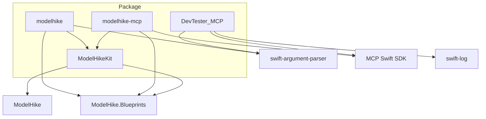

# Architecture

## Top-Level Design

The package has four targets:

## Target Roles

### `ModelHikeKit`

Shared engine layer.

Responsibilities:

- resolve input sources
- resolve inline/file/directory inputs into upstream partial pipelines
- extract diagnostics from debug sessions
- map ModelHike snapshots into clean Codable results
- expose one async API per command/tool

Primary files:

- `Sources/ModelHikeKit/ModelHikeEngine.swift`
- `Sources/ModelHikeKit/DiagnosticExtractor.swift`
- `Sources/ModelHikeKit/SnapshotMapper.swift`
- `Sources/ModelHikeKit/DependencyWalker.swift`
- `Sources/ModelHikeKit/Results/*`

### `ModelHikeCLI`

Thin command layer built with `swift-argument-parser`.

Responsibilities:

- parse flags and arguments
- resolve stdin / file / directory input
- call `ModelHikeEngine`
- format output as JSON or human-readable text
- map result states to process exit codes

### `ModelHikeMCP`

Thin MCP server built with the official Swift MCP SDK.

Responsibilities:

- register tools
- map tool calls to `ModelHikeEngine`
- return structured content

### `DevTester_MCP`

In-repo MCP smoke-test executable. Launches `modelhike-mcp` as a child process, connects as an MCP client, and runs configurable assertions against all 6 tools.

Responsibilities:

- launch `modelhike-mcp` via `swift run` or a prebuilt binary
- initialize an MCP client session over a custom child-process stdio transport
- call each tool with default or user-supplied model fixtures
- assert structural expectations (diagnostic codes, entity counts, blueprint lists, generated file paths)
- produce pretty or JSON summary output

## Engine Flow

`ModelHikeEngine` currently works in four stages:

1. resolve `ModelInput`
2. prepare `PipelineConfig`, `DefaultDebugRecorder`, and an `InlineModelLoader` that preserves the resolved source identifiers
3. run the required upstream partial `Pipeline`
4. map debug/model output into public result types

## Input Resolution

`ModelInput` supports:

- `.content(String)`
- `.file(String)`
- `.directory(String)`

Resolution behavior:

- file input also loads adjacent `common.modelhike` and `main.tconfig` if present
- directory input loads all `*.modelhike` plus optional `common.modelhike` and `main.tconfig`
- inline content is treated as one domain model source

## How Validation Works

Validation now uses the upstream `ValidateModelsPass` inside a partial pipeline:

1. `LoadModelsPass`
2. `HydrateModelsPass`
3. `PassDownAndProcessAnnotationsPass`
4. `ValidateModelsPass`

Diagnostics are recorded by upstream passes into the debug log, captured by `DefaultDebugRecorder`, and normalized into `ModelHikeKit.Diagnostic` by `DiagnosticExtractor`.

For `W301`-`W306`, upstream validation now preserves the parsed model line that triggered the warning when source metadata is available, so file, line number, and line content survive through to CLI/MCP results.

This gives:

- stable severity
- optional code
- message
- source reference
- suggestions

## How Explain / Inspect / Dependency Analysis Work

After hydration, the engine captures a `ModelSnapshot` through `DefaultDebugRecorder`.

`SnapshotMapper` transforms:

- `ContainerSnapshot` → `ContainerSummary`
- `ModuleSnapshot` → `ModuleSummary`
- `ObjectSnapshot` → `EntitySummary`

`DependencyWalker` then performs:

- reverse-reference discovery
- `inspect` reference collection
- `what-depends-on` output construction

## How Generation Works

Generation uses an upstream partial pipeline ending in `GenerateCodePass`.

The engine:

1. registers `OfficialBlueprintFinder()` and optional `localBlueprintsPath` on the `PipelineConfig`
2. sets optional blueprint override and generation-target fields on `PipelineConfig`
3. runs `LoadModelsPass` → `HydrateModelsPass` → `PassDownAndProcessAnnotationsPass` → `ValidateModelsPass` → `GenerateCodePass`
4. reads in-memory rendered output through `pipeline.state.renderedOutputRecords()`
5. correlates rendered content with debug-session generated file metadata
6. returns `GenerationResult`

This means generation can be inspected without persisting to disk.

If the CLI is called with `--output`, the returned file list is then written out explicitly by the CLI layer.

## Why The Engine Still Resolves Inputs Itself

The engine now uses the upstream `Pipeline` and `InlineModelLoader` for the actual work, but it still resolves inputs itself first because the Smart CLI supports:

- stdin content
- single-file input with adjacent `common.modelhike`
- directory input with optional `main.tconfig`

So `ModelHikeKit` keeps a thin input-resolution layer, then hands the resolved content to upstream partial pipelines through `InlineModelLoader` while preserving identifiers like `stdin.modelhike`, `common.modelhike`, and `main.tconfig` for parse/runtime diagnostics.

## Result-Type Contract

All public result types are:

- `Codable`
- `Sendable`
- `Equatable`
- stable enough to be used from CLI JSON output and MCP structured content

Every result type includes a `diagnostics: [Diagnostic]` array. This is a consistent pattern — agents and tools should always check diagnostics regardless of the command.

Current public results:

- `ValidationResult` — `valid`, `diagnostics`, `summary: DiagnosticSummary`
- `GenerationResult` — `files`, `tree`, `diagnostics`, `summary: GenerationSummary`
- `ExplanationResult` — `containers`, `diagnostics`, `summary: ModelSummary`
- `InspectionResult` — `entity?`, `references`, `generatedArtifacts`, `diagnostics`
- `DependencyResult` — `entity`, `dependents`, `diagnostics`
- `BlueprintListResult` — `blueprints`, `diagnostics`
- `Diagnostic` — `severity: DiagnosticSeverity`, `code?`, `message`, `source?`, `suggestions`

## Testing Strategy

Tests use Swift Testing (`import Testing`), not XCTest.

Current tests focus on:

- unresolved-type validation behavior (`ValidateTests`)
- explanation/model-summary behavior (`ExplainTests`)
- bundled blueprint discovery and generation (`BlueprintsTests`)

Additionally, `DevTester_MCP` provides end-to-end MCP smoke tests that launch the server as a child process and exercise all 6 tools over stdio.

Preferred pattern:

- inline model strings
- deterministic assertions
- no dependence on local interactive state

## Evolution Rules

If you change:

- public result shapes
- command names or flags
- MCP tool names or schemas
- generation semantics
- blueprint resolution behavior
- test conventions

then update:

- `AGENTS.md`
- this document
- `docs/cli-reference.md`
- `docs/mcp-reference.md`
